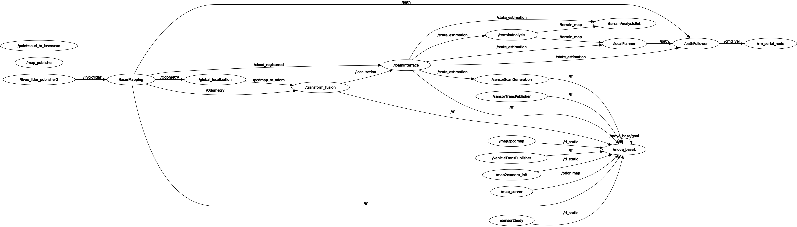
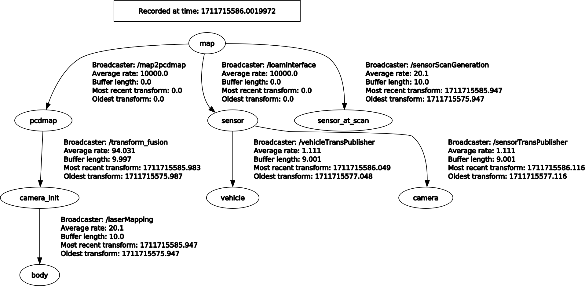

# RM_NAV

## Introduction

Hi, welcome to the RCS team’s 2024 season Sentinel robot navigation framework repository. We refer to the open source **[Autonomous Navigation System](https://www.cmu-exploration.com/)** of CMU, use **[FAST LIO](https://github.com/hku-mars/FAST_LIO)** for state estimation, and introduce **move base** for global path planning.

## File Tree

```arduino
rm_nav
├── src
│   ├── rm_launch
│   │
│   ├── local_module
│   │   └── autonomous_exploration_development_environment
│   │
│   ├── global_module
│   │   └── rm_global_planner
│   │
│   ├── serial_module
│   │   └── rm_serial
│   │
│   └── state_estimation_module
│		├── FAST_LIO
│	    └── FAST_LIO_LOCALIZATION
│
└── README.md
```

## How to Run


### Prerequisites

1. OS

   Ubuntu 20.04

   ROS noetic

2. [Livox-SDK2](https://github.com/Livox-SDK/Livox-SDK2) && [livox_ros_driver2](https://github.com/Livox-SDK/livox_ros_driver2)

3. dependence

   ```bash
   sudo apt update
   sudo apt install libusb-dev libpcl-ros-dev -y
   ```

### Build

Clone this repository. Then, compile.

```bash
git clone 
source your/livox_ros_driver2/devel/setup.bash  # for fast_lio
catkin_make
```

**Note:** if you get an error like: ` <fastlio/Pose6D.h> No such file `, try to source the workspace and then compile again.

### Run

#### mapping

```bash
roslaunch rm_launch mapping.launch
```

#### navigation

```bash
roslaunch rm_launch navigation.launch
```

## Node Graph



## TF Tree



pcdmap -> camera_init -> body : like map -> odom -> baselink. Since our lidar is inverted, but the map frame is upright. So we add a new frame, pcdmap, for localization module. And we publish a static tf

## Topic List

### global planner module

- global planner
  - subscriber
  - publisher
- waypoint
  - subscriber
  - publisher

### local planner module

#### loam interface

- loamInterface

  - subscriber

    - /Odometry: `nav_msgs::Odometry`

      里程计输入接口

    - /cloud_registered’: `sensor_msgs::PointCloud2`

      点云数据输入接口

  - publisher

    - /state_estimation: `nav_msgs::Odometry`

      sensor的位姿，map→sensor的tf

    - /registered_scan: `sensor_msgs::PointCloud2`

      点云frame_id = "map”

#### terrain analysis

- terrainAnalysis

  - subscriber

    - /state_estimation: `nav_msgs::Odometry`

      更新vehicle位姿信息，并根据机器人的移动距离来更新`noDataInited`的状态。

    - /registered_scan: `sensor_msgs::PointCloud2`

      更新激光云数据。遍历激光云中的每一个点。对于每一个点，函数首先计算该点与机器人的距离。然后，函数检查该点的Z坐标是否在`(minRelZ - disRatioZ * dis，maxRelZ + disRatioZ * dis)`范围内，并且该点与机器人的距离是否小于`terrainVoxelSize * (terrainVoxelHalfWidth + 1)`。如果满足这些条件，那么该点会被添加到`laserCloudCrop`中，并且该点的强度会被设置为从系统初始化开始到现在的时间。

    - /joy

      手柄控制相关

    - /map_clearing

  - publisher

    - /terrain_map: `sensor_msgs::PointCloud2`

      frame_id = "map”

#### local planner

- localPlanner

  - subscriber

    - /state_estimation: `nav_msgs::Odometry`

      解算“/vehicle”的位姿，传入的是“sensor”的位姿，默认sensor和vehicle是固连的，即只有位置不同，姿态是一样的

    - /registered_scan: `sensor_msgs::PointCloud2`

      点云获取，由参数`useTerrainAnalysis`决定是否使用terrainAnalysis处理后的点云，再筛选出在`adjacentRange`内的点云

    - /terrain_map: `sensor_msgs::PointCloud2`

      点云获取，由参数`useTerrainAnalysis`决定是否使用terrainAnalysis处理后的点云，再筛选出在`adjacentRange`内点云高度（`point.intensity`）大于障碍物高度阈值（`obstacleHeightThre`）的点云

    - /joy

      手柄控制相关

    - /way_point: `geometry_msgs::PointStamped`

      获取目标点的二维坐标（x,y）

    - /speed

      手柄控制速度相关

    - /navigiation_boundary: `geometry_msgs::PolygonStamped`

      获取导航边界，rviz中绿色的边界线，如一堵墙不可越过

    - /added_obstacles

    - /check_obstacle

  - publisher

    - /path: `nav_msgs::Path`

      最后解算出的路径，frame_id = "vehicle”

    - /free_paths: `sensor_msgs::PointCloud2`

      离线计算的路径，在rviz中用黄色显示，`adjacentRange`是他的半径大小

- pathFollower

  - subscriber

    - /state_estimation: `nav_msgs::Odometry`

      解算“/vehicle”的位姿，传入的是“sensor”的位姿，默认sensor和vehicle是固连的，即只有位置不同，姿态是一样的。检查机器人的倾斜角度和角速度是否超过了设定的阈值。如果超过了阈值，并且启用了相应的标志（`useInclToStop`或`useInclRateToSlow`），则记录当前的时间戳到`stopInitTime`或`slowInitTime`

    - /path: nav_msgs::Path

      获取local_planner结算出的路径，重置全局变量`path`，并将`pathPointID`置0、`pathInit`置true

    - /joy

      手柄控制相关

    - /speed

      手柄控制速度相关

    - /stop: `std_msgs::Int8`

  - publisher

    - /cmd_vel: `geometry_msgs::TwistStamped`

      frame_id = "vehicle”

#### terrain analysis ext

- terrainAnalysisExt

  - subscriber

    - /state_estimation: `nav_msgs::Odometry`

      更新vehicle位姿

    - /registered_scan: `sensor_msgs::PointCloud2`

      同terrain_analysis

    - /joy:

      手柄控制相关

    - /cloud_clearing: `std_msgs::Float32`

    - /terrain_map: `sensor_msgs::PointCloud2`

  - publisher

    - /terrain_map_ext: `sensor_msgs::PointCloud2`

#### sensor scan generation

- sensorScanGeneration
  - subscriber
    - /state_estimation: `nav_msgs::Odometry`
    - /registered_scan: `sensor_msgs::PointCloud2`
  - publisher
    - /state_estimation_at_scan: `nav_msgs::Odometry`
    - /sensor_scan: `sensor_msgs::PointCloud2`

### state estimation && serial module

#### state estimation

- livox_ros2_driver
- fastlio

#### serial

- serial

## TODO

- [ ] Simplify tf tree.
